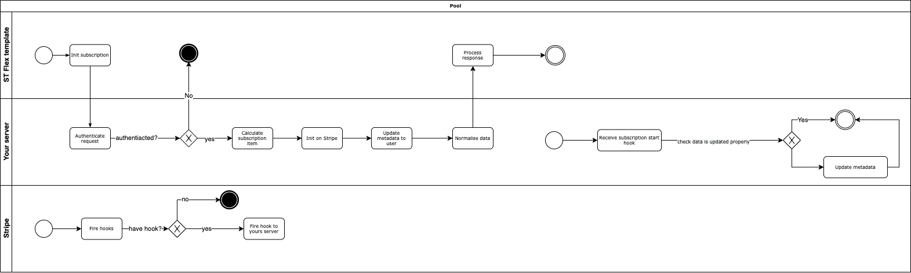

# COMMERCIAL-IN-CONFIDENCE
# Table of Contents
- [Table of Contents](#table-of-contents)
- [Introduction](#introduction)
  - [A bit of blabbering](#a-bit-of-blabbering)
    - [Fitting with your marketplace](#fitting-with-your-marketplace)
    - [Foreseen problem](#foreseen-problem)
  - [Preparation](#preparation)
    - [Note](#note)
    - [Stripe](#stripe)
      - [Some concepts about Stripe](#some-concepts-about-stripe)
  - [Overall solution](#overall-solution)
- [Recipes](#recipes)
  - [Composing promises](#composing-promises)
  - [Creating Stripe product](#creating-stripe-product)
    - [Get listing data](#get-listing-data)
    - [Create product params](#create-product-params)
  - [Init subscription](#init-subscription)
    - [User2Admin](#user2admin)
      - [Incoming Params](#incoming-params)
    - [Customer2Provider](#customer2provider)
      - [Incoming Params](#incoming-params-1)
    - [Fetching users data](#fetching-users-data)
      - [Common fetch users data used by both provider and customer](#common-fetch-users-data-used-by-both-provider-and-customer)
      - [Customer](#customer)
        - [Finding Stripe customer on Stripe](#finding-stripe-customer-on-stripe)
      - [Provider](#provider)
    - [Checking requirement](#checking-requirement)
      - [User2Admin](#user2admin-1)
      - [Provider2Customer](#provider2customer)
    - [Talk to Stripe](#talk-to-stripe)
      - [Map input params to Stripe params](#map-input-params-to-stripe-params)
        - [Common function to map our line items to Stripe's line items](#common-function-to-map-our-line-items-to-stripes-line-items)
        - [User2Admin](#user2admin-2)
        - [Customer2Provider](#customer2provider-1)
    - [Normalise returned subscription data](#normalise-returned-subscription-data)
  - [Update subscription](#update-subscription)
    - [Common logic](#common-logic)
    - [Incoming params](#incoming-params-2)
    - [Updating subscription in Stripe](#updating-subscription-in-stripe)
      - [Creating params](#creating-params)
      - [Creating updated items](#creating-updated-items)
  - [Integrating with template](#integrating-with-template)
    - [Create sdk instance point to our server](#create-sdk-instance-point-to-our-server)
    - [Initiate subscription call](#initiate-subscription-call)
      - [Saving customer credit card first](#saving-customer-credit-card-first)
    - [Request payment](#request-payment)
  - [Respond to Flex event](#respond-to-flex-event)
  - [Respond to Stripe event](#respond-to-stripe-event)
  - [Payout](#payout)
  - [Utility](#utility)
    - [Object to to camel case](#object-to-to-camel-case)
    - [Create ST Flex error object](#create-st-flex-error-object)
    - [Initiate Stripe instance](#initiate-stripe-instance)


# Introduction

TLDR; 
> Adding subscription functionality is hard, hence our first cookbook.

---

Online marketplaces has evolved tremendously over the years. With Sharetribe Flex's help it is even easier to setup your marketplace. But due to COVID-19, marketplaces have gained alot of attention. As as result, ideas for creating marketplace has become incredibly diverse.

Subscription functionality has been frequently requested by Sharetribe Flex marketplace owners for the following 2 use case.
1) marketplace subscription fees for layering functionality - for example the marketplace offers 3 subscription tiers, SILVER, GOLD, PLATINUM with each tier offering different levels of functionality or benefits for the user; or 
2) Recurring rental between the provider and customer - for example your marketplace providers want to offer large equipment for long term rental to customers, the transaction allows for recurring rental payments at different frequencies for a period of time.

the list is getting longer by day. 

We hope that you enjoy our first cookbook. It should help you to configure your subscritpion functionality the way you want. We want to improve this product so please give us feedback. 

## A bit of blabbering

Before begin, first, let's answer these 2 important questions:
- Is our solution Mr. Right?
- What's the catch? 

Being able to know these answers before might save you lots of time and effort so please be patient and stick with me here.

### Fitting With Your Marketplace

Let's consider these aspects to see if it's a right fit for you:
  
1) **Development Effort**: yes, you will need a developer to connect the dots. 
2) **Capability**: Admin2Customer, Admin2Provider, Customer2Provider.
3) **Supported Countries**: Depends - Right now the guide is using Stripe so whatever Stripes supports,
4) **Supported Payment Method**: Saved credit cards only. We are working on ACH and other types of payment supported by Stripe.
5) **Payment Compliance**: we would use Stripe & ST Flex API built-in mechanism.
6) **Languages**: Javascript
7) **Required Experience**: Should be familiar with Flex API, React.js and how Stripe works (Which we would be covering some essential part here)

### Foreseen Problem

- The solution would heavily depends on using ST Flex Web template and Stripe API so if either of them has big changes, this guide could become obsolete.

- Stripe's subscription is still in the beta state. You would need to email them to get access to the beta program. But because of that, the APIs would be subject to changes in the future.

## Preparation


### Note

To help you understand the argument definition better, these recipes would use ST Flex web template's way of declaring default props for incoming params. In actual implementation, it could be different.

### Stripe

- Supported version: from `2020-08-27` and above
- Email to Stripe and ask to join beta problem for using `on_behalf_of` for subscription

#### Some Concepts About Stripe

- **Stripe Pricing Id**: So for `User2Admin` cases, you can use Stripe's dashboard to define the subscription plan that the user can subscribed to. And you can then attach a price to those plan. Those prices would have their own set of unique ID, which we would usually refer as `pricingId`
- **Product**: This is a Stripe concept. It's meaning would be similar to the listing on your marketplace

## Overall Solution

We are using:
- ST Flex Web Template
- A server (you can use ST Flex's built in or use a light-weight ExpressJS server, or even a Deno server if you are a fan of experimenting with new languages)
- Stripe webhooks (for you to respond to Stripe subscription events such as end/start,...etc)

# Recipes

## Composing Promises

From now on, the example code will use the following concepts:
-  `Curry function` - You can read more about it [here](https://medium.com/javascript-scene/curry-and-function-composition-2c208d774983)
-  `composePromises` Function. The purpose is to create an easy to read promise chain where the output of the current function would be the input of the next one.

Here is a simple implementation of `composePromises`, there are far better ways of achieving it, so this is not the only way to compose promises:

```js
const composeMRight = method => (...ms) => (
  ms.reduceRight((f, g) => x => g(x)[method](f))
);
//This one is used to inject your own logic onto the current execution
//Result of the previous function is the args of the current function
export const composePromises = composeMRight('then');
```

## Creating Stripe Product

To create a subscription to a listing which belongs to the provider, create a Stripe product. There are multiple places where you can create a product:
- At the point of listing creation - use ST Flex's event and detect if there are any listing creation event, then sync with Stripe
- At the point of initiating a subscription transaction - this helps reduce duplication of data if on your marketplace there might be only a portion of listings that offer subscription
- Manually using Stripe dashboard - usually for `User2Admin` case where the product is actually the marketplace's service and does not align to any listing.

```js
export const createStripeProduct = listingId => {
   return composePromises(
    getListingData,
    createProductParams,
    //You would need to init a Stripe instance somewhere and import it
    stripe.products.create,
  )({ listingId: id, include: ['author'] });
}
```
### Get Listing Data

```js
export const getListingData = ({ id, include = ['author'] }) =>
  integrationSdk.listings.show({
    id,
    include,
  }).then(response => {
    const entities = denormalisedResponseEntities(response);
    if (entities.length !== 1) {
      throw new Error('Expected a resource in the integrationSdk.listings.show response');
    }
    return entities[0];
  });
```
### Create Product Params

```js
const createProductParams = async (listing) => {
  //TODO: Add more needed attributes to this place
  return {
    id: listing.id.uuid,
    name: listing.attributes.title,
  }
}
```
## Init Subscription

Here is a simple flow chart of what we would do:



I will not go deeper in the `authentication` aspect and only focus on how would we interact with our server & Stripe here. So assuming we have already verified the incoming request -  meaning it's from a trusted source.

### User2Admin
When it's subscription `User2Admin`:
```js
const { customerId } = fnParams;

const initSubscription = composePromises(
      fetchCustomer,
      checkRequirement,
      initSubscription(fnParams),
      normaliseSubscriptionData,
      //Adding extra steps to modify ST Flex user data if needed
    )(customerId);
```

#### Incoming Params

A note here is that the `customerId` is the ST Flex UUID of the customer. We would need it to fetch more detail about the customer's data which usually includes saved credit cards, data from Stripe that belongs to that customer.

`fnParams` for `User2Admin`
```js
const fnParams = {
  customerId: uuid.isRequired,
  params: shape({
    protectedData: object,
    lineItems: arrayOf(shape({
      //Price id of the subscription plan that you defined in the dashboard
      pricingId: string.isRequired, 
      quantity: number.isRequired
    }))
  })
}
```

A refresher - For admin to user, we can define the subscription plan using the Stripe dashboard and each price would have their own ID. That's why we only need to parse in the price ID and the quantity the user want to subscribe to.

### Customer2Provider

When it's subscription `Customer2Provider`:
```js
const { customerId, providerId } = fnParams;

const initSubscription = composePromises(
    fetchUsersData,
    checkRequirement,
    init(fnParams),
    normaliseSubscriptionData,
    //Adding extra steps to modify ST Flex user data if needed
  )({
    customerId,
    providerId
  })
```

#### Incoming Params

A note here is that the `customerId` and `providerId` is the ST Flex UUID of the customer and the provider. We would need it to fetch more detailed about the customer's data and also need to check if the provider has already connected to Stripe or not.

`fnParams` for `Customer2Provider`
```js
const fnParams = {
  customerId: uuid.isRequired,
  providerId: uuid.isRequired,
  params: shape({
    bookingStartTime: number,
    bookingEndTime: number,
    commissionPercentage: number,
    protectedData: object,
    lineItems: arrayOf(shape({
      pricingId: string,
      quantity: number.isRequired,
      priceData: shape({
        //You need to create a Stripe product first to use this
        listingId: uuid.isRequired,
        interval: shape({
          period: oneOf(['day', 'week', 'month', 'year']).isRequired,
          count: number.isRequired
        }),
        price: shape({
          amount: number.isRequired,
          currency: string.isRequired
        })
      })
    }))
  })
}
```

### Fetching Users Data

So there would be 2 entities for us to fetch, the `customer` and the `provider`, for `Customer2Provider`case, we would create a function to fetch both in parallel, while in the `User2Admin` case, we would only need the `fetchCustomer` function.


#### Common Fetch Users Data used by both Provider and Customer

```js
export const getUserData = ({ id, include = ['profileImage'] }) =>
  integrationSdk.users.show({
    id,
    include,
  }).then(response => {
    const entities = denormalisedResponseEntities(response);
    if (entities.length !== 1) {
      throw new Error('Expected a resource in the integrationSdk.users.show response');
    }
    return entities[0];
  });
```
#### Customer

There would be 2 types of data we need to fetch:
- `Data from ST Flex`
- `Customer data from Stripe`

```js
const fetchCustomer = async (id) => {
  return Promise.all([
    getUserData({ id, include: ['stripeAccount'] }),
    findStripeCustomer(id)
  ]).then(([customer, stripeCustomer]) => {
    customer.stripeCustomer = stripeCustomer;
    return customer;
  })
}
```
##### Finding Stripe Customer on Stripe

```js
import pick from "lodash/pick";

const LIMIT = 100;
const CUSTOMER_ATTRIBUTES_TO_TAKE_FROM_STRIPE = [
  "id",
  "subscriptions",
  "tax_ids",
  "invoice_settings",
];

export const findStripeCustomer = async (id, anchor = null) => {
  const params = {
    limit: LIMIT,
  };
  if (anchor) {
    params.starting_after = anchor;
  }
  const customersRes = await stripe.customers.list(params);
  const customers = customersRes.data;
  const customer = customers.find(customer =>
    customer.metadata['sharetribe-user-id'] === userId);

  if (customer) {
    return convertObjToCamelCase(pick(customer, CUSTOMER_ATTRIBUTES_TO_TAKE_FROM_STRIPE));
  }

  if (!customersRes.has_more) {
    return null;
  }

  return findStripeCustomer(userId, customers[customers.length - 1].id);
}
```

#### Provider

For provider we would also need to fetch the provider's connected account. Luckily, ST Flex integration sdk already give us support for that so the `fetchProvider` function would be much more simple

```js
export const fetchProvider = async (id) => {
  return getUserData({ id, include: ['stripeAccount'] });
}
```

### Checking Requirement

#### User2Admin

We would be using ST Flex template's built in mechanism to save credit card (This one would be covered in another recipe). So our user should already save credit card first before initiating the subscription. We can check other validation logic here as well.

```js
const NO_PAYMENT_METHOD_ERROR = 'NO_PAYMENT_METHOD_ERROR';

export const checkSubscriptionRequirement = async (customer) => {
  const { stripeCustomer } = customer;

  if (!stripeCustomer ||
    !stripeCustomer.invoiceSettings ||
    !stripeCustomer.invoiceSettings.defaultPaymentMethod) {
    throw ({
      code: 404,
      data: createFlexErrorObject({
        status: 404,
        message: NO_PAYMENT_METHOD_ERROR,
        messageCode: NO_PAYMENT_METHOD_ERROR
      })
    });
  }

  return customer;
}
```

#### Provider2Customer

We would need to check if the customer has credit card and if provider has already connected their account

```js
const HAVE_NOT_CONNECTED_STRIPE_ACCOUNT = 'HAVE_NOT_CONNECTED_STRIPE_ACCOUNT';
const NO_PAYMENT_METHOD_ERROR = 'NO_PAYMENT_METHOD_ERROR';

export const checkSubscriptionRequirement = async ({ customer, provider }) => {
  const { stripeCustomer } = customer;

  if (!stripeCustomer ||
    !stripeCustomer.invoiceSettings ||
    !stripeCustomer.invoiceSettings.defaultPaymentMethod) {
    throw ({
      code: 404,
      data: createFlexErrorObject({
        status: 404,
        message: NO_PAYMENT_METHOD_ERROR,
        messageCode: NO_PAYMENT_METHOD_ERROR
      })
    });
  }

  const { stripeAccount } = provider;

  if (!stripeAccount ||
    !provider.attributes.stripeConnected) {
    throw ({
      code: 404,
      data: createFlexErrorObject({
        status: 404,
        message: HAVE_NOT_CONNECTED_STRIPE_ACCOUNT,
        messageCode: HAVE_NOT_CONNECTED_STRIPE_ACCOUNT
      })
    });
  }

  return {
    customer,
    provider
  };
}

```
### Talk to Stripe

So basically depends on which cases we are on, we would receive either 
```js
{
  provider,
  customer
}
```
or just
```js
{
  customer
}
```

If it's `User2Admin`:

```js
const initSubscription = (fnParams) => async ({
  customer,
}) => {
  return composePromises(
    createUser2AdminSubscriptionParams,
    //Calling Stripe directly
    stripe.subscriptions.create
  )({
    fnParams,
    customer,
  });
}
```

If it's `Customer2Provider`:

```js
const initSubscription = (fnParams) => async ({
  customer,
  provider
}) => {
  return composePromises(
    createCustomer2ProviderSubscriptionParams,
    //Calling Stripe directly
    stripe.subscriptions.create
  )({
    fnParams,
    customer,
    provider
  });
}
```

#### Map input params to Stripe params

##### Common function to map our line items to Stripe's line items

```js
const WRONG_PARAMS = 'WRONG_PARAMS';

const createItems = lineItems => lineItems.map(({
  pricingId,
  priceData,
  quantity
}) => {
  if (pricingId) {
    return {
      price: pricingId,
      quantity
    }
  }

  if (priceData) {
    const {
      listingId,
      price: {
        amount,
        currency
      },
      interval: {
        period,
        count
      },
    } = priceData;

    return {
      price_data: {
        product: listingId,
        unit_amount: amount,
        currency: currency,
        recurring: {
          interval: period,
          interval_count: count
        }
      },
      quantity
    }
  }

  throw ({
    code: 400,
    data: createFlexErrorObject({
      status: 400,
      message: WRONG_PARAMS,
      messageCode: WRONG_PARAMS
    })
  });
});
```

##### User2Admin

```js
const createUser2AdminSubscriptionParams = async ({
  fnParams,
  customer
}) => {
  const {
    params: {
      lineItems,
      protectedData = {}
    }
  } = fnParams;

  const items = createItems(lineItems);

  //TODO: Inject your own params to configure Stripe subscription to your liking here.
  //Full documentation: https://stripe.com/docs/api/subscriptions/create
  return {
    customer: customer.stripeCustomer.id,
    items,
    metadata: {
      protectedData: JSON.stringify(protectedData),
      'sharetribe-user-id': customer.id.uuid,
    }
  };
}
```

##### Customer2Provider

```js
const createCustomer2ProviderSubscriptionParams = async ({
  fnParams,
  customer,
  provider
}) => {
  const {
    params: {
      lineItems,
      protectedData,
      bookingStartTime,
      bookingEndTime,
      commissionPercentage,
    }
  } = fnParams;

  const items = createItems(lineItems);

  const params = {
    customer: customer.stripeCustomer.id,
    items,
    transfer_data: {
      destination: provider.stripeAccount.attributes.stripeAccountId,
    },
    metadata: {
      protectedData: protectedData ? JSON.stringify(protectedData) : {},
      'sharetribe-user-id': customer.id.uuid,
      'sharetribe-provider-id': provider.id.uuid,
      'stripe-destination': provider.stripeAccount.attributes.stripeAccountId,
      'stripe-customer': customer.stripeCustomer.id,
    },
    on_behalf_of: provider.stripeAccount.attributes.stripeAccountId
  };

  if (bookingStartTime) {
    params.trial_end = bookingStartTime;
  }
  if (bookingEndTime) {
    params.cancel_at = bookingEndTime;
  }
  if (commissionPercentage) {
    /**
     * Because subscription is hard to calculate pro-rated amount
     * Stripe can't create subscription with flat-fee
     * You want to take flat-fee, you must set it separately by invoice
     * Create a webhook to receive when an invoice is called and set the @application_fee_amount
     * Further guide: https://stripe.com/docs/connect/subscriptions#subscription-invoices
     */
    params.application_fee_percent = commissionPercentage;
  }

  return params;
}
```
### Normalise Returned Subscription Data

```js
export const DETAILS_SUBSCRIPTION_ATTRIBUTES_TO_TAKE_FROM_STRIPE = [
  "id",
  "cancel_at_period_end",
  "current_period_end",
  "current_period_start",
  "items",
  "latest_invoice",
  "status",
  "days_until_due",
  "trial_end",
  "livemode",
  "metadata",
  "tax_percent",
  "customer"
];

export const SUBSCRIPTION_ITEMS_ATTRIBUTES_TO_TAKE_FROM_STRIPE = [
  "id",
  "metadata",
  "price",
  "quantity",
];

export const SUBSCRIPTION_PRICING_ATTRIBUTES_TO_TAKE_FROM_STRIPE = [
  "id",
  "interval",
  "interval_count",
  "livemode",
  "tiers",
  "tiers_mode",
  "currency",
  "amount",
  "amount_decimal",
  "billing_scheme",
  "nickname"
];
export const SUBSCRIPTION_BOOKING_TYPE = 'subscription-booking';
export const SUBSCRIPTION_STRIPE_CUSTOMER_TYPE = 'stripe-customer';

const normaliseSubscriptionData = async (stripeSubscriptionEntity) => {
  const subscription = pick(stripeSubscriptionEntity, DETAILS_SUBSCRIPTION_ATTRIBUTES_TO_TAKE_FROM_STRIPE);

  const subscriptionInCamelCase = convertObjToCamelCase(subscription);
  const {
    id,
    metadata,
    customer,
    cancelAtPeriodEnd,
    currentPeriodEnd,
    currentPeriodStart,
    daysUntilDue,
    taxPercent,
    status,
  } = subscriptionInCamelCase;

  return {
    data: {
      id: new UUID(id),
      types: SUBSCRIPTION_TYPE,
      attributes: {
        taxPercent,
        status,
        items: subscription.items.data.map(item => {
          return {
            ...convertObjToCamelCase(
              pick(item, SUBSCRIPTION_ITEMS_ATTRIBUTES_TO_TAKE_FROM_STRIPE)
            ),
            price: convertObjToCamelCase(
              pick(item.price, SUBSCRIPTION_PRICING_ATTRIBUTES_TO_TAKE_FROM_STRIPE)
            )
          }
        }),
        protectedData: metadata.protectedData
          ? JSON.parse(metadata.protectedData)
          : {}
      },
      relationships: {
        stripeCustomer: {
          data: {
            id: new UUID(customer),
            type: SUBSCRIPTION_STRIPE_CUSTOMER_TYPE
          }
        },
        booking: {
          data: {
            id: new UUID(subscription.id),
            type: SUBSCRIPTION_BOOKING_TYPE,
          }
        }
      },
    },
    included: [
      {
        id: new UUID(customer),
        type: SUBSCRIPTION_STRIPE_CUSTOMER_TYPE
      },
      {
        id: new UUID(subscription.id),
        type: SUBSCRIPTION_BOOKING_TYPE,
        cancelAtPeriodEnd,
        daysUntilDue,
        start: new Date(currentPeriodStart * 1000),
        bookingStart: new Date(currentPeriodStart * 1000),
        end: new Date(currentPeriodEnd * 1000),
        bookingEnd: new Date(currentPeriodEnd * 1000)
      },
    ],
  }

}
```
## Update Subscription

### Common Logic

```js
export const updateSubscription = async (fnParams) => {
  const { id } = fnParams;

  return composePromises(
    stripe.subscriptions.retrieve,
    normaliseSubscriptionData
    updateSubscriptionOnStripe(fnParams),
    normaliseSubscriptionData,
  )(id);
}
```
### Incoming Params

So you can add more attributes to map to Stripe subscription data if needed, but for the sake of simplicity the recipe only shows the most basic choice, which is creating new line items for changing subscription plans or create a new one. Some example of what could be added later:
- Cancel subscription
- Resume current subscription cycle
- ...

```js
const fnParams = {
  id: string.isRequired,
  params: shape({
    lineItems: arrayOf(shape({
      pricingId: string,
      quantity: number.isRequired,
      priceData: shape({
        listingId: uuid.isRequired,
        interval: shape({
          period: oneOf(['day', 'week', 'month', 'year']).isRequired,
          count: number.isRequired
        }),
        price: shape({
          amount: number.isRequired,
          currency: string.isRequired
        })
      })
    }))
  })
}
```
### Updating Subscription in Stripe

```js
const updateSubscriptionOnStripe = (fnParams) => async (subscription) => {
  const {
    params: {
      lineItems,
      protectedData
    }
  } = fnParams;

  return stripe.subscriptions.update(
    subscription.id.uuid,
    createParams({
      subscription,
      lineItems,
      protectedData
    }));
}
```
#### Creating Params
So for this one the line item logic needs to be adjusted a bit. We would need to notify Stripe which item needs to be updated and which item needs to be removed

```js
const createParams = ({
  subscription,
  lineItems,
  protectedData
}) => {
  const items = createUpdatedItems({
    lineItems,
    currentItems: subscription.attributes.items,
  });
  const params = {
    items
  };

  if (protectedData) {
    params.metadata = JSON.stringify({
      ...subscription.attributes.protectedData,
      ...protectedData
    });
  }

  return params;
}
```
#### Creating Updated Items
```js
const WRONG_PARAMS = 'WRONG_PARAMS';

const createNewItems = lineItems => lineItems.map(({
  priceData,
  quantity
}) => {
  if (!priceData) {
    throw ({
      code: 400,
      data: createFlexErrorObject({
        status: 400,
        message: WRONG_PARAMS,
        messageCode: WRONG_PARAMS
      })
    });
  }
  const {
    listingId,
    price: {
      amount,
      currency
    },
    interval: {
      period,
      count
    },
  } = priceData;

  return {
    price_data: {
      product: listingId,
      unit_amount: amount,
      currency: currency,
      recurring: {
        interval: period,
        interval_count: count
      }
    },
    quantity
  }
});

const createUpdatedItems = ({
  lineItems,
  currentItems
}) => {
  const newItems = createNewItems(lineItems.filter(item => !!item.priceData));
  const desiredItems = lineItems.filter(item => !!item.pricingId).map(item => {
    const {
      pricingId,
      quantity
    } = item;
    return {
      price: pricingId,
      quantity
    }
  });
  const updatedItems = currentItems.map((currentItem) => {
    const {
      price,
      id
    } = currentItem;
    const existingItem = desiredItems.find(item => item.price === price.id);

    if (!existingItem) {
      return {
        id,
        deleted: true
      }
    }

    existingItem.inOldPlan = true;

    return {
      id,
      quantity: existingItem.quantity
    };
  });

  return [
    ...newItems,
    ...updatedItems,
    ...desiredItems.filter(item => !item.inOldPlan)
  ];
}
```
## Integrating with ST Flex Web Template

This would entirely depend on how you expose your logic from the server out. So in Journey Horizon, we configure a custom API gateway that can receive and process ST Flex transit-json requests. So for the example, we would use ST Flex client SDK to create and update subscription transaction. And to make things easy, we would inject that SDK into ST Flex's SDK when it is created.

### Create SDK Instance Point to our Server

You need to find all of the places that ST Flex team initiate their SDK instance inside of the template, the code snippet would usually looks like this

```js
const sdk = sharetribeSdk.createInstance({
    transitVerbose: TRANSIT_VERBOSE,
    clientId: CLIENT_ID,
    httpAgent: httpAgent,
    httpsAgent: httpsAgent,
    tokenStore,
    typeHandlers: sdkUtils.typeHandlers,
    ...baseUrl,
  });
```

we would then inject our sdk like this

```js
const baseUrl = BASE_URL ? { baseUrl: BASE_URL } : {};

const sdk = sharetribeSdk.createInstance({
    transitVerbose: TRANSIT_VERBOSE,
    clientId: CLIENT_ID,
    httpAgent: httpAgent,
    httpsAgent: httpsAgent,
    tokenStore,
    typeHandlers: sdkUtils.typeHandlers,
    ...baseUrl,
  });

//Replace with your own server url
const CUSTOM_SERVER_BASE_URL = 'https://api.journeyh.io'; 

const customServerBaseUrl = CUSTOM_SERVER_BASE_URL 
  ? { baseUrl: CUSTOM_SERVER_BASE_URL } 
  : {};

const jhSdk = sharetribeSdk.createInstance({
    transitVerbose: TRANSIT_VERBOSE,
    clientId: CLIENT_ID,
    httpAgent: httpAgent,
    httpsAgent: httpsAgent,
    tokenStore,
    typeHandlers: sdkUtils.typeHandlers,
    ...customServerBaseUrl,
  });

sdk.jh = jhSdk;  
```

### Initiate Subscription Call

We would re-use Flex's checkout page, modify its logic from
```js
const handlePaymentIntentCreation = composeAsync(
      fnRequestPayment,
      fnConfirmCardPayment,
      fnConfirmPayment,
      fnSendMessage,
      fnSavePaymentMethod
    );
```

to 

```js
const handleSubscriptionCreation = composeAsync(
      fnSavePaymentMethod
      fnRequestPayment,
      //Might not need this if you have trial and do off-session payment
      fnConfirmCardPayment,
    );
```

#### Saving Customer Credit Card First

To make it easy, we will copy the logic from `PaymentMethodsPage`

```js
//Should be in @handlePaymentIntent function
const fnSavePaymentMethod = (fnParams) => {
  const { stripe, card, billingDetails } = handlePaymentParams;

  const stripeCustomer = ensuredCurrentUser.stripeCustomer;

  await onCreateSetupIntent()
      .then(setupIntent => {
        const stripeParams = {
          stripe,
          card,
          setupIntentClientSecret: getClientSecret(setupIntent),
          paymentParams: {
            payment_method_data: {
              billing_details: billingDetails,
            },
          },
        };

        return onHandleCardSetup(stripeParams);
      })
      .then(result => {
        const newPaymentMethod = result.setupIntent.payment_method;
        // Note: stripe.handleCardSetup might return an error inside successful call (200), but those are rejected in thunk functions.

        return onSavePaymentMethod(stripeCustomer, newPaymentMethod);
      })
      .catch(error => {
        console.error(error);
      });

  return fnParams;
}

//Remember to map these dispatch to props in the checkout page.
const mapDispatchToProps = dispatch => ({
  //Fill in current dispatch,...
  onHandleCardSetup: params => dispatch(handleCardSetup(params)),
  onCreateSetupIntent: params => dispatch(createStripeSetupIntent(params)),
  onSavePaymentMethod: (stripeCustomer, newPaymentMethod) =>
    dispatch(savePaymentMethod(stripeCustomer, newPaymentMethod)),
});

```
### Request Payment

```js
const orderParams = {
    providerId: new UUID('authorId'), //Normal string would also be ok
    params: {
      bookingStartTime: 1610392000,
      bookingEndTime: 1617166800,
      commissionPercentage: 15,
      lineItems: [
        {
          quantity: 1,
          priceData: {
            //For the sake of flexibility, we do not require the listing's author to be the provider
            listingId: '5ff7d62d-ad1e-435c-b3d2-0f3797388fc6',
            interval: {
              period: 'month',
              count: 1
            },
            price: {
              amount: 10000,
              currency: 'USD'
            }
          }
        }
      ]
    }
  }

export const initiateOrder = (orderParams) => (dispatch, getState, sdk) => {
  dispatch(initiateOrderRequest());

  const handleSucces = response => {
    const entities = denormalisedResponseEntities(response);
    const order = entities[0];
    dispatch(initiateOrderSuccess(order));
    dispatch(fetchCurrentUserHasOrdersSuccess(true));
    return order;
  };

  const handleError = e => {
    dispatch(initiateOrderError(storableError(e)));
    const transactionIdMaybe = transactionId ? { transactionId: transactionId.uuid } : {};
    log.error(e, 'initiate-order-failed', {
      ...transactionIdMaybe,
      listingId: orderParams.listingId.uuid,
      bookingStart: orderParams.bookingStart,
      bookingEnd: orderParams.bookingEnd,
    });
    throw e;
  };

  //So in JH we setup a server that have /transactions URL that would receive request like ST Flex. We would use this one for the subscription request 
  return sdk.jh.transactions
      .initiate(bodyParams, queryParams)
      .then(handleSucces)
      .catch(handleError);
};
```

## Respond to Flex Event

These would be ideas for you to extend the base. You can create a transaction on Flex and let your user & operator interact with that transaction then use ST Flex's event query to detect the changes. You can then update the subscription details accordingly

Ex: when creating a subscription, you would also create a transaction on ST Flex and save the Stripe subscription id to the transaction's metadata

## Respond to Stripe Event

Stripe offers webhook which would be helpful for:
- Detecting user has paid
- Detecting user has not paid
- Checking subscription status changes (trail to active,...etc)

```js
//Use these function in place that receive incoming request
export const receiveStripeEvent = async (
  //Taken from the request body
  requestBody,
  //Taken from stripe's hook request headers @stripe-signature
  signature,
  //Stripe would give you a secret to verify its signature when creating a webhook to verify request
  endpointSecret
) => {
  let event = null;
  try {
    event = stripe
      .webhooks
      .constructEvent(requestBody, signature, endpointSecret);
  }
  catch (err) {
    return {
      code: 400,
      data: {
        message: `Webhook Error: ${err.message}`
      }
    };
  }

  // Handle the event
  const { account, data: { object } } = event;

  switch (event.type) {
    case 'customer.subscription.created': {
      //Respond to subscription creation
    }
    case 'customer.subscription.updated': {
      //Respond to subscription status changes
    }
    case 'customer.subscription.deleted': {
      //Respond to subscription end
    }
    default: {
      return {
        code: 200,
        data: {
          received: true
        }
      };
    }
  }
```


## Payout

For `Customer2Provider` case, you would need to create your own payout scheduler since by default ST Flex would disable the automatic provider payout. For `User2Admin`, the default payout schedule still apply.
## Utility
### Object to to camel case

```js
import { transform, set, camelCase } from 'lodash'
import {
  isArray, isObjectLike, isPlainObject, map,
} from 'lodash/fp'

export const convertObjToCamelCase = obj => {
  if (isArray(obj)) {
    return obj.map(convertObjToCamelCase, obj);
  }
  if (isPlainObject(obj)) {
    const iteratee = (result, value, key) =>
      set(
        result,
        camelCase(key),
        isObjectLike(value)
          ? convertObjToCamelCase(value)
          : value
      );
    return transform(obj, iteratee);
  }
  return obj
}
```

### Create ST Flex Error Object

So to make things consistent, we would try to create error message that looks like ST Flex's format

```js
import { types as sdkTypes } from 'sharetribe-flex-integration-sdk';

const { UUID } = sdkTypes;
const CUSTOM_ERROR_ID = 'jh-custom-error-id';

export const createFlexErrorObject = ({
  message,
  messageCode,
  status
}) => {
  return {
    errors: [
      {
        id: new UUID(CUSTOM_ERROR_ID),
        status,
        title: message,
        messageCode,
        code: messageCode
      }
    ]
  }
}
```

### Initiate Stripe instance

```js
import Stripe from "stripe";
import config from '../config';

const stripe = new Stripe(config.stripe.secret, {
  apiVersion: config.stripe.apiVersion,
  maxNetworkRetries: config.retries
});

export default stripe;
```

# That's a Wrap
If you have any questions about using the cookbook and find bugs in the code, please reach out to support@journeyhorizon.com or talk to us via the intercom.io chat button on our website www.journeyh.io. Good luck with your marketplace build. 

# TERMS OF USE
## Commercial-In-Confidence
The content of this document is Commercial-In-Confidence and covered by Non-Disclosure Agreement.

## Grant of Copyright License. 
Subject to the terms and conditions of this License, JourneyHorizon Pty Ltd grants to You a perpetual, worldwide, non-exclusive copyright license to reproduce, prepare Derivative Works of, publicly display, and publicly perform in Source or Object form for a single Marketplace built using Sharetribe Flex.

## Charges and Royalties
Any charges or Royalties associated with this License have been agreed between the JourneyHorizon Pty Ltd and You. Any non-payment of such Charges and Royalties shall terminate this license.

## Redistribution. 
You may not reproduce and distribute copies of the Work or Derivative Works thereof in any medium, with or without modifications, and in Source or Object form.

## Assignment.
You may assign this License as part of any Asset or Company sale to a third-party.

## Trademarks. 
This License does not grant permission to use the trade names, trademarks, service marks, or product names of the Licensor, except as required for reasonable and customary use in describing the origin of the Work and reproducing the content of the NOTICE file.

## Disclaimer of Warranty. 
Unless required by applicable law or agreed to in writing, Licensor provides the Work (and each Contributor provides its Contributions) on an "AS IS" BASIS, WITHOUT WARRANTIES OR CONDITIONS OF ANY KIND, either express or implied, including, without limitation, any warranties or conditions of TITLE, NON-INFRINGEMENT, MERCHANTABILITY, or FITNESS FOR A PARTICULAR PURPOSE. You are solely responsible for determining the appropriateness of using or redistributing the Work and assume any risks associated with Your exercise of permissions under this License.

## Limitation of Liability
In no event and under no legal theory, whether in tort (including negligence), contract, or otherwise, unless required by applicable law (such as deliberate and grossly negligent acts) or agreed to in writing, shall any Contributor be liable to You for damages, including any direct, indirect, special, incidental, or consequential damages of any character arising as a result of this License or out of the use or inability to use the Work (including but not limited to damages for loss of goodwill, work stoppage, computer failure or malfunction, or any and all other commercial damages or losses), even if such Contributor has been advised of the possibility of such damages.
